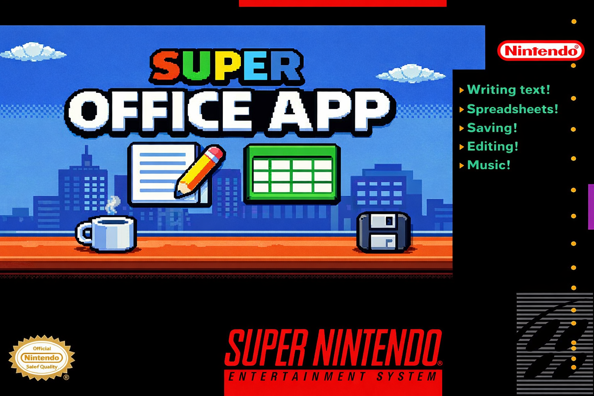

# Super Office App

A productivity suite for the Super Nintendo Entertainment System. Write text documents, build spreadsheets, save your work to battery-backed SRAM, and do it all with a mouse — just like the real thing, but on a 16-bit console from 1991.

Built entirely in 65816 assembly with heavy assistance from [Claude Code](https://claude.ai/claude-code).

## Features

### Text Editor
- Full on-screen keyboard with mouse-driven input
- SHIFT toggle for uppercase, lowercase, digits, and symbols
- Insert, backspace, and delete operations
- Vertical scrolling for documents up to 2 KB
- Blinking text cursor

### Spreadsheet Editor
- 5-column by 32-row cell grid (columns A through E)
- Click-to-select cell navigation
- Per-cell text entry (up to 8 characters)
- Column and row headers with active cell highlighting
- Vertical scrolling

### Save System
- 8 file slots on 32 KB battery-backed SRAM
- Save, Save As (with filename entry), and Close with dirty-check prompts
- File browser with load and delete support
- Files tagged by type (TXT / SHT)

### Audio
- Lo-fi office background music (2 original tracks)
- Sound options for volume control and music on/off

### Mouse-Only Input
- Designed for the SNES Mouse (like Mario Paint)
- Left-click to select and confirm
- Right-click to go back, open menus, and cancel
- No joypad required or supported


https://github.com/user-attachments/assets/27d2ae0b-108f-4aa7-ba97-f9ff4c01ee1f


## Building

### Prerequisites

- [WLA-DX](https://github.com/vhelin/wla-dx) assembler toolchain (`wla-65816` and `wlalink` must be on your PATH)

### Build

```bash
make
```

This produces `super-office-app.smc`, a standard SNES ROM that runs in any accurate emulator (bsnes, Mesen, snes9x) or on real hardware via flash cart.

```bash
make clean   # removes build artifacts
```

### Image Conversion Tools

The `tools/` directory contains Python scripts for converting PNG artwork to SNES-native tile formats. These require Python 3 and [Pillow](https://pillow.readthedocs.io/). They are not needed for building the ROM — the converted assets are already checked in under `gfx/converted/`.

## Technical Details

See [CLAUDE.md](CLAUDE.md) for full architecture documentation: memory maps, PPU configuration, state machine design, audio engine internals, SRAM layout, WLA-DX assembler gotchas, and coding conventions.
